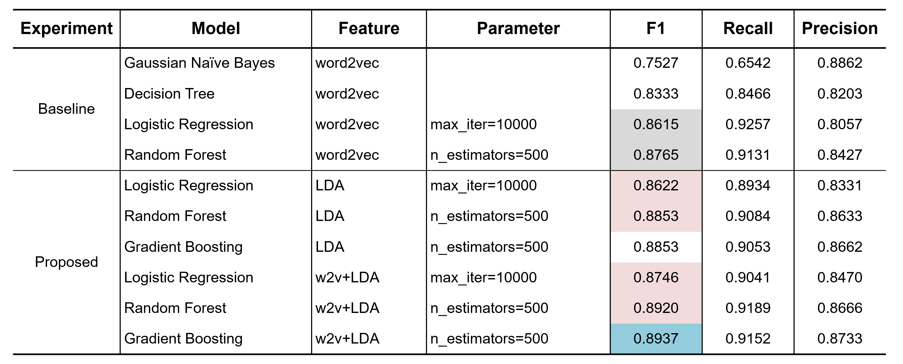

## 1. Introduction

Understanding sentiment of game reviews is important for game developers as well as investment companies. However, gaming is a domain in which in-group users have mutual but specific words and expressions which makes text mining harder. Our project focused on sentiment classification problems on game reviews from Steam. Beyond the generic word2vec embeddings, we applied the semi-supervised topic analysis method guided LDA, which can incorporate domain knowledge to generate probability distribution of a review belonging to different topics. We found that performance of Random Forest and Logistic Regression improved when using LDA features or LDA features and word2vec embeddings together, compared with using word2vec only. We also experimented with the popular Gradient Boosting Machine for sentiment classification and applied the Bayesian Optimization method to speed up hyperparameter tuning process. The F1 score of our final model is 0.8997.

## 2. Project Findings: Why LDA Works?

We proposed a way to explain why topic features can improve the performance. In word2vec we used in baseline models, the vector of a center word was trained by the neighbor word pairs within a certain window. This training mechanism makes the created word vector incorporate the local semantic relations, and usually results in generated similar vectors with similar part-of-speech tagging. Thus, words with opposite polarity in sentiment can be clustered into the same group. However, compared to word2vec which incorporates more local information, the LDA algorithm incorporates more global statistical information because it assigns an undecided word to a topic whose words more frequently come along with the undecided word within all reviews, regardless of their positions in the reviews. And the pre-assigned seed words boost the prior probability more. From the feature importance of GBM , we found that all topic features were in the top, which is a further proof of the aforementioned limitation of word2vec and our good choices of pre-assigned words for guided LDA.

## 3. Project Setup

- [Dataset](https://www.kaggle.com/luthfim/steam-reviews-dataset)
- [Trained guided LDA model](https://drive.google.com/file/d/1KUajX39TLNAoHHALycGaOQelZxoNSobt/view?usp=sharing): traning LDA may need hours  
- Code setup  
  - Step1: running guided LDA (guided_lda.ipynb)
  - Step2: preprocessing, baseline experiments, and proposed method (experiments.ipynb)  
